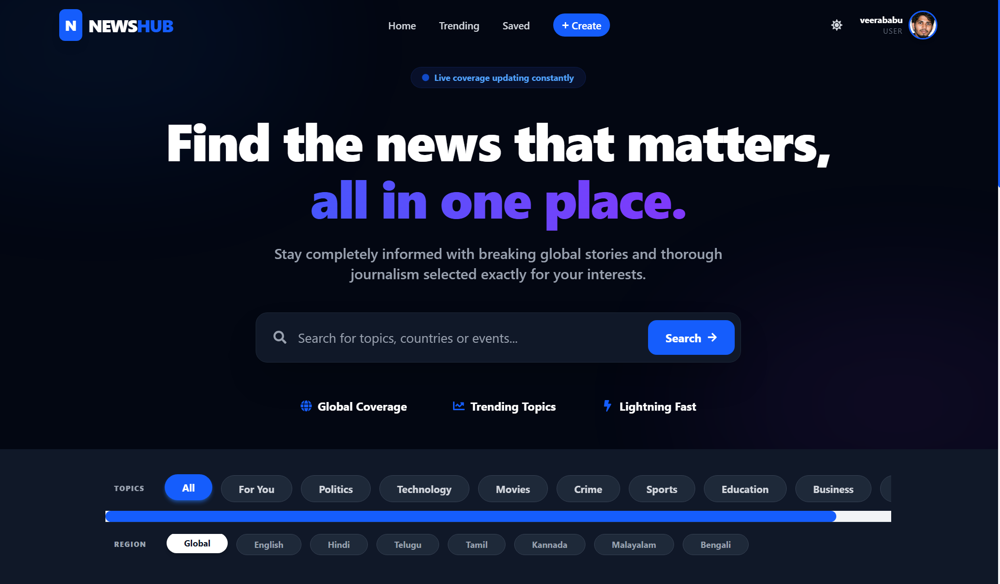
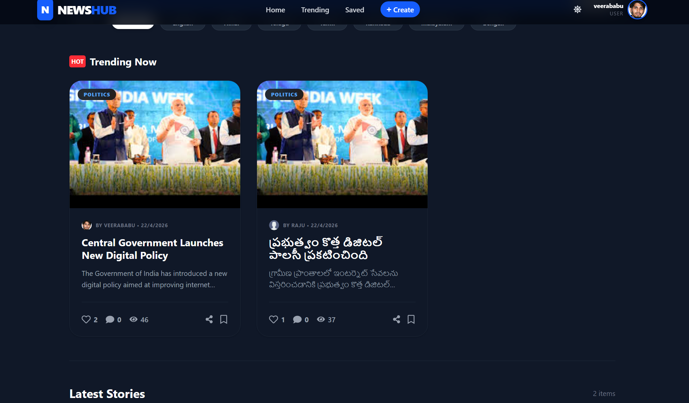
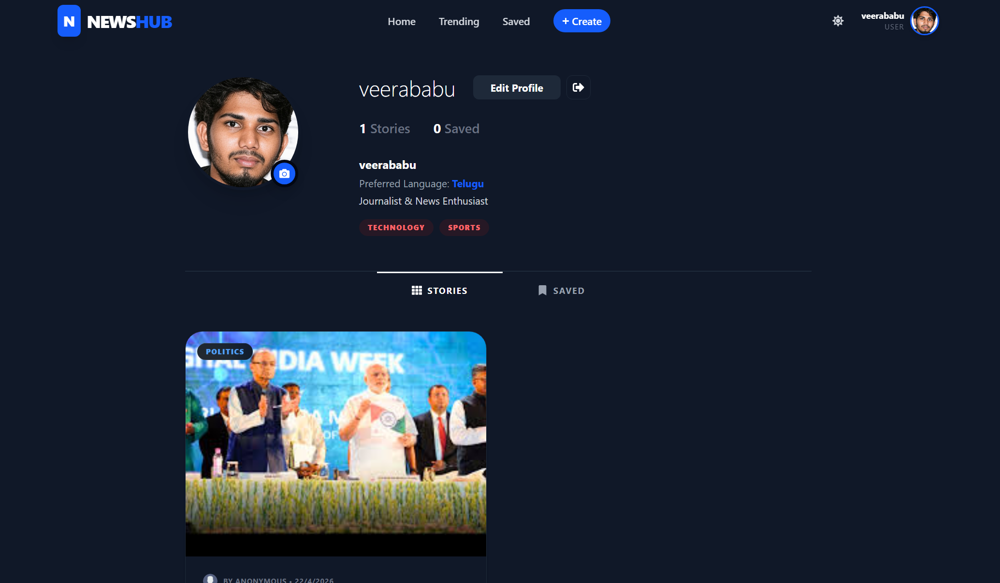

# 📰 NewsHub - Intelligent Full-Stack News Platform

NewsHub is a deeply optimized, production-level Full-Stack web application that radically improves how users consume news. Powered by the MERN stack (MongoDB, Express, React, Node.js), this platform offers AI-generated quick summaries, a dynamic "For You" recommendation engine, and extensive user-engagement tools like Recursive Deep-Comments, Real-time View Tracking, and Bookmarks.



## 🚀 Features

*   **Dynamic AI Summarization:** Automatically summarizes lengthy article descriptions into digestible, highly-readable brief overviews using AI integrations.
*   **Custom "For You" Algorithm:** Profiles track user interests and execute lightning-fast `$in` MongoDB queries to personalize user feeds instantly. 
*   **Real-time View Counters:** Optimistic UI state manipulation combined with asynchronous background `PUT` tracking keeps views highly accurate without UI lag.
*   **Robust Social Engagement:** 
    *   **Bookmarks:** Save stories to a dedicated profile tab.
    *   **Nested Comments:** Engage efficiently with endless parent-child nested comment trees natively inside React components.
    *   **Likes:** Fully functional like system.
*   **Cloudinary Image Hosting:** Optimized multipart form processing limits posts to a maximum of 2 images and offloads the buffers to Cloudinary CDNs via `multer`.
*   **Advanced Image Carousel:** A robust, logic-driven dynamic Image carousel for multi-image articles with seamless modulo arithmetic sliding logic.
*   **Multi-Dimensional Filtering:** Highly scalable URL `useSearchParams` controls mapping Search Queries, Language, and Categories flawlessly across standard React routes.

## 📸 Screenshots

### The Explore & Discovery Interface


### The User Profile Dashboard


## 🛠️ Technology Stack

| Technology | Implementation |
| :--- | :--- |
| **Frontend Platform** | React.js (Vite), Framer Motion (GPU animations), React Router DOM (query params) |
| **Styling** | TailwindCSS, Glassmorphism, Modern typography frameworks |
| **Backend API** | Node.js, Express.js |
| **Database** | MongoDB, Mongoose (NoSQL sub-collections for nesting comments/replies) |
| **Authentication** | JSON Web Tokens (JWT), Encrypted Cookie Storage |
| **Storage & CDNs** | Cloudinary (Image Processing), Native CDN Favicons |

## ⚙️ Installation & Local Setup

**1. Clone the repository**
```bash
git clone https://github.com/Cveerababu15/NEWS-HUB.git
cd NEWS-HUB
```

**2. Configure the Backend**
```bash
cd backend
npm install
```
*Create a `.env` file in the `backend/` folder and include your keys:*
```env
PORT=5000
MONGODB_URI=your_mongodb_cluster_uri
JWT_SECRET=your_secret_hash
CLOUDINARY_CLOUD_NAME=your_cloudinary_name
CLOUDINARY_API_KEY=your_key
CLOUDINARY_API_SECRET=your_secret
GEMINI_API_KEY=your_ai_key
```

**3. Configure the Frontend**
```bash
cd frontend
npm install
```

**4. Boot the Servers**
Open two terminal windows:
```bash
# Terminal 1: Backend
cd backend
npm start

# Terminal 2: Frontend
cd frontend
npm run dev
```

## 🧠 Architectural Highlights

The MERN architecture strictly follows SoC (Separation of Concerns). The backend utilizes dedicated controller routes (`userController.js`, `newsController.js`) mapped to Express routing files. The UI uses optimistic state handling to intercept clicks and immediately push visual updates before the asynchronous backend cycle resolves, guaranteeing a frictionless user interaction model. 

---
**Developed and engineered by Veerababu.**
